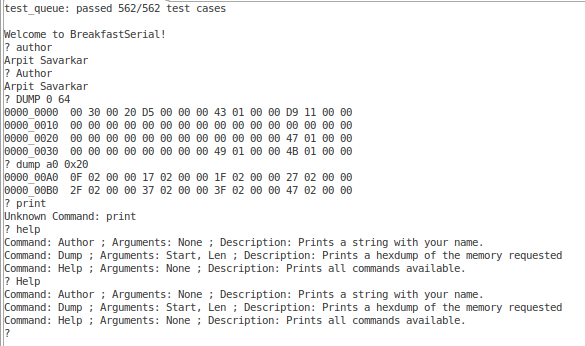
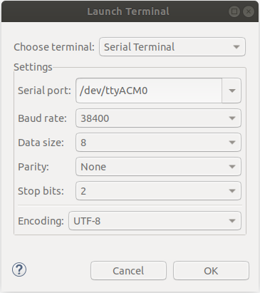

# PES-Assignment-6
Author: Arpit Savarkar

## Repository Comments 
_Contains_
Code for Assignment 6 for Principals of Embedded Systems Software, ECEN-5813, Fall 2020
Only DEBUG Target is considered for this assignment whose goal is setting up an initial command processor running over the
serial line
contact arpit.savarkar@colorado.edu

### Repository for PES-Assignment 6

Source Code for this assignment can be found under source/

- <b>main.c - The main script which initializes the UART functionalities and begins the application mode </b>
- <b>cli.h - Header file of cli.c defining the Command Line Interface Functionalities</b>
- <b>cli.c - Handles the Parsing and Management of Command entered by the user and handles Command Line Interfacing received over UART</b>
- <b>hexdump.h - Header file of hexdump.c defining helper functions for printing hexdump from a specified location </b>
- <b>hexdump.c -  Prints representing a “dump” of the nbytes of memory starting at loc. Bytes are printed up to 16 bytes per line, separated by newlines. </b>
- <b>queue.h - Header file which contains the function prototypes and enumerators needed for queue.c </b>
- <b>queue.c - The main script for instantiating and testing a Circular Buffer based Queue </b>
- <b>sysclock.h - Header file which contains the function prototypes and enumerators needed for sysclock.c </b>
- <b>sysclock.c - The main script for instantiating System Clock </b>
- <b>UART.h - Header file which contains the function prototypes and enumerators needed for UART.c </b>
- <b>UART.c - The main script for instantiating UART functionalities and handling Interfacing with the user </b>
- <b>test_queue.h - Header file which contains the function prototypes and enumerators needed for test_queue.h </b>
- <b>UART.c - The main script for Testing the functioning of Circular Buffer </b>

## Project Comments
This projects implements the following routine :  

Intially the test harness showcases the number of test cases passed  

The command processor running on your device should starts by printing a prompt (“? ”). It should then
wait for a command typed by the user, and then respond to that command.  
As each character is received by your command processor loop, you will need to echo that character
back so that the user can see it printed in his or her terminal window. You do not need to handle the
backspace key or any arrow keys.  

- A circular buffer implementation. You will need two circular buffer objects, one each for the
transmit and receive directions. These may be allocated statically (the preferred approach), or
they may be allocated dynamically at initialization time 1 . Each circular buffer should have a
capacity of 256 bytes.

- Test code to exercise your circular buffer. You may wish to adapt the automated tests you
created for Assignment 2. This code should run at startup if the DEBUG define is set in your
code, in order to give you confidence that your circular buffers are solid.

- Code to configure UART0 and send and receive data over it. Parameters for this assignment
are specified below. Your implementation should be fully interrupt based 2 . The UART solution
should be built atop your circular buffer implementation.

- Glue code that ties your UART communication code into the standard C library functions.
After this glue code is working, a call to printf() or putchar() on the device should result in
characters being sent over UART0 to the PC, and a call to getchar() should result in reading a
character that the user typed on the PC.

- A command processor that can accept some very simple interactive commands (specified
below) and take action on the device.

## Installation/Execution Notes
Developed using MCUExpresso on Linux.  
    DEBUG Target - Prints DEBUG Messages to UART terminal.  

## Images of the OUTPUT on terminal 

- Terminal Output  

- UART Setup  

## Extra Credit 
- Backspace Functionality is implemented
- Help Functionality is implemented 